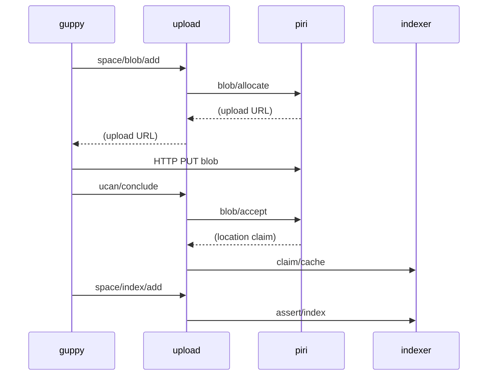

# Smelt - Local Development Environment for Storacha

This document provides context for AI-assisted development with Claude Code. It describes the project structure, key concepts, and common operations needed to work effectively with this codebase.

## Project Overview

Smelt orchestrates a complete Storacha network on a single machine using Docker Compose. The environment includes 10+ services: blockchain, storage nodes, indexing, upload coordination, and a CLI client. Its purpose is straightforward: let developers test changes locally without deploying to production or coordinating with others.

The name comes from metallurgy (extracting metal from ore), not ichthyology (a small fish). The metaphor is apt; the reality is Docker containers.

## Key Concepts

Understanding these concepts will save considerable debugging time.

### Storacha

A decentralized storage network where data is stored across multiple providers with cryptographic verification. Content is addressed by CID (Content Identifier), and storage providers prove they actually hold the data they claim to hold.

### UCAN (User Controlled Authorization Networks)

Capability-based authorization using signed tokens. Instead of asking a server "may I do this?", a UCAN proves "I have been granted permission to do this." Key terminology:

- **Invocation**: A signed request to perform an action
- **Delegation**: Granting capabilities to another principal
- **Receipt**: Proof that an invocation was executed
- **Capability**: A specific permission (e.g., `space/blob/add`, `blob/allocate`)

### DID (Decentralized Identifiers)

Service identities follow the pattern `did:web:<service-name>` for human-readable names, mapped to `did:key:z6Mk...` cryptographic identifiers. Each service has its own keypair in `generated/keys/`.

### PDP (Provable Data Possession)

Blockchain-verified storage proofs. Piri (the storage node) periodically proves to on-chain contracts that it still holds stored data. The signing-service handles blockchain transaction signing.

## Directory Structure

```
smelt/
├── compose.yml              # Root compose file - includes all systems
├── Makefile                 # Primary developer interface
├── scripts/
│   └── init.sh             # Environment initialization
├── generated/               # Generated at runtime (gitignored)
│   ├── keys/               # Ed25519 (.pem) and EVM (.hex) keys
│   │   ├── piri.pem        # Storage node identity
│   │   ├── indexer.pem     # Indexer identity
│   │   ├── delegator.pem   # Delegation service identity
│   │   ├── upload.pem      # Upload service identity
│   │   └── payer-key.hex   # Blockchain transaction signing
│   ├── proofs/             # UCAN delegation proofs
│   ├── generate-keys.sh    # Key generation script
│   └── generate-proofs.sh  # Proof generation script
├── systems/                 # Service modules (each self-contained)
│   ├── blockchain/         # Local EVM (Anvil) with PDP contracts
│   ├── common/             # Shared infrastructure (DynamoDB Local, Redis)
│   ├── signing-service/    # PDP blockchain signing
│   ├── delegator/          # UCAN delegation issuance
│   ├── indexing/           # Content discovery
│   │   ├── ipni/          # InterPlanetary Network Indexer
│   │   └── indexer/       # Content claims cache
│   ├── piri/              # Storage node
│   ├── upload/            # Upload orchestration (mock w3infra)
│   └── guppy/             # CLI client
└── docs/
    └── ARCHITECTURE.md     # Detailed service interaction diagrams
```

Each system directory contains:
- `compose.yml` - Docker Compose configuration
- `config/` - Service-specific configuration files
- `entrypoint.sh` - Container initialization (where applicable)
- `README.md` - System-specific documentation

## Common Tasks

### Starting and Stopping

```bash
make up        # Start all services (runs init if needed)
make down      # Stop services (data preserved in volumes)
make restart   # Stop then start
make fresh     # Delete everything and rebuild (destructive)
make clean     # Stop and delete volumes only (keeps keys)
```

### Viewing Status and Logs

```bash
make status                    # Service health overview
make logs                      # Follow all logs
docker compose logs -f piri    # Follow specific service
docker compose logs -f upload indexer  # Multiple services
```

### Interactive Debugging

```bash
make shell-guppy    # Shell into guppy container
make shell-piri     # Shell into piri container

# Or directly:
docker compose exec guppy bash
docker compose exec piri bash
docker compose exec upload sh
```

### Testing the Upload Flow

```bash
# Enter the guppy container
make shell-guppy

# Create an account (inside container)
guppy login test@example.com

# Create a storage space
guppy space create my-test-space

# Upload a file
echo "test content" > /tmp/test.txt
guppy upload /tmp/test.txt

# The upload traverses: guppy -> upload -> piri -> indexer
# with blockchain proofs submitted via signing-service
```

### Regenerating Keys and Proofs

```bash
make regen    # Regenerate all keys and proofs
# Then restart services to pick up new keys:
make clean && make up
```

## Service Ports

| Service | Port | Protocol | Description |
|---------|------|----------|-------------|
| blockchain | 8545 | JSON-RPC | Anvil local EVM |
| dynamodb-local | 8000 | HTTP | State persistence |
| redis | 6379 | Redis | Indexer cache |
| signing-service | 7446 | HTTP | PDP signing |
| delegator | 8081 | HTTP/UCAN | Delegation issuance |
| ipni | 3000, 3002, 3003 | HTTP | Content discovery |
| indexer | 9000 | HTTP/UCAN | Claims cache |
| piri | 3333 | HTTP/UCAN | Storage node |
| upload | 8080 | HTTP/UCAN | Upload coordination |
| guppy | (none) | CLI | Client container |

Note: Some services use different internal vs external ports (e.g., piri listens on 3000 internally, exposed as 3333).

## Configuration Files

### Service Configuration
- `systems/<service>/compose.yml` - Docker Compose for each system
- `systems/<service>/config/` - Service-specific configuration
- `systems/<service>/entrypoint.sh` - Container initialization scripts

### Generated Credentials
- `generated/keys/*.pem` - Ed25519 service identity keys
- `generated/keys/*.pub` - Public keys (for reference)
- `generated/keys/*.hex` - EVM keys (blockchain signing)
- `generated/proofs/*.txt` - UCAN delegation proofs

## Service Interactions

The data flow for a typical upload:



The signing-service and blockchain are involved when piri submits PDP proofs, but that happens asynchronously from the upload flow.

## Development Conventions

### Use Makefile Targets

Prefer `make up` over raw `docker compose up -d`. The Makefile handles initialization, provides consistent flags, and documents available operations via `make help`.

### Service Isolation

Each system in `systems/<name>/` is self-contained and can theoretically run standalone, though most depend on other services. Dependencies are declared in each compose.yml via `depends_on` with health checks.

### Network Topology

All services connect to a shared `storacha-network` Docker network. Service names are DNS-resolvable within the network (e.g., `http://piri:3000` from upload service).

### Key Generation

Keys are generated fresh per-installation and are not committed to version control. If you clone on a new machine, `make up` will generate new keys automatically.

### DID Identity Pattern

Services use `did:web:<service-name>` identifiers that map to `did:key:z6Mk...` cryptographic keys. The mapping is configured in each service's environment variables (`PRINCIPAL_MAPPING`).

## Testing Checklist

After making changes to service code or configuration:

1. **Reset the environment**: `make fresh` (or `make clean && make up` to preserve keys)
2. **Wait for health**: `make status` - all services should show "healthy"
3. **Test upload flow**: `make shell-guppy` then run upload commands
4. **Check logs**: `make logs` or target specific services

## Troubleshooting

### Services Won't Start

```bash
make status              # Check which services are unhealthy
docker compose logs <service>  # Check specific service logs
```

Common causes:
- Missing dependencies (check `depends_on` in compose.yml)
- Port conflicts (another process using required ports)
- Missing keys (`make init` or `make fresh`)

### UCAN/Delegation Errors

- Verify delegator is healthy: `curl http://localhost:8081/`
- Check that upload service can reach DynamoDB
- Confirm `PRINCIPAL_MAPPING` environment variables are correct

### Piri Connection Failures

- Check piri health: `curl http://localhost:3333/`
- Verify signing-service is healthy (needed for PDP operations)
- Check blockchain is running: `curl -X POST http://localhost:8545 -H "Content-Type: application/json" -d '{"jsonrpc":"2.0","method":"eth_blockNumber","params":[],"id":1}'`

### "Handler Not Found" Errors

The capability string must match exactly. `space/blob/add` is not `blob/add`. Check the handler registration in the relevant service.

## Related Repositories

| Repository | Description |
|------------|-------------|
| `storacha/piri` | Storage node implementation |
| `storacha/guppy` | CLI client |
| `storacha/indexing-service` | Indexer service |
| `storacha/delegator` | Delegation service |
| `storacha/go-ucanto` | UCAN implementation in Go |
| `storacha/specs` | Protocol specifications |

## Further Reading

- `docs/ARCHITECTURE.md` - Detailed service interaction diagrams and data flows
- `README.md` - Quick start guide and architecture overview
- Individual `systems/<service>/README.md` files for service-specific details
