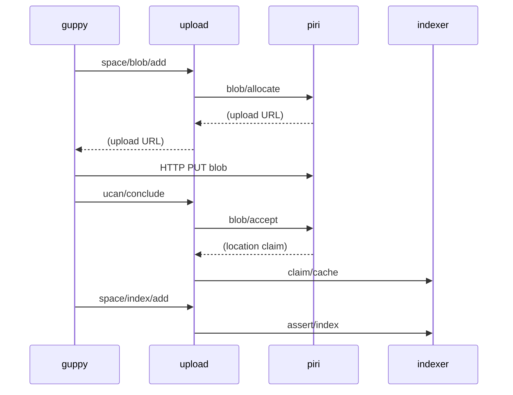

# Smelt - Local Development Environment for Storacha

This document provides context for AI-assisted development with Claude Code. It describes the project structure, key concepts, and common operations needed to work effectively with this codebase.

## Project Overview

Smelt orchestrates a complete Storacha network on a single machine using Docker Compose. The environment includes 10+ services: blockchain, storage nodes, indexing, upload coordination, and a CLI client. Its purpose is straightforward: let developers test changes locally without deploying to production or coordinating with others.

The name comes from metallurgy (extracting metal from ore), not ichthyology (a small fish). The metaphor is apt; the reality is Docker containers.

## Key Concepts

Understanding these concepts will save considerable debugging time.

### Storacha

A decentralized storage network where data is stored across multiple providers with cryptographic verification. Content is addressed by CID (Content Identifier), and storage providers prove they actually hold the data they claim to hold.

### UCAN (User Controlled Authorization Networks)

Capability-based authorization using signed tokens. Instead of asking a server "may I do this?", a UCAN proves "I have been granted permission to do this." Key terminology:

- **Invocation**: A signed request to perform an action
- **Delegation**: Granting capabilities to another principal
- **Receipt**: Proof that an invocation was executed
- **Capability**: A specific permission (e.g., `space/blob/add`, `blob/allocate`)

### DID (Decentralized Identifiers)

Service identities follow the pattern `did:web:<service-name>` for human-readable names, mapped to `did:key:z6Mk...` cryptographic identifiers. Each service has its own keypair in `generated/keys/`.

### PDP (Provable Data Possession)

Blockchain-verified storage proofs. Piri (the storage node) periodically proves to on-chain contracts that it still holds stored data. The signing-service handles blockchain transaction signing.

## Directory Structure

```
smelt/
├── .env                     # Service image defaults (configurable)
├── smelt.yml                # Piri node manifest (count + per-node storage)
├── compose.yml              # Root compose file - includes all systems
├── Makefile                 # Primary developer interface
├── cmd/smelt/               # Go CLI: `smelt generate` reads smelt.yml
├── pkg/
│   ├── manifest/            # smelt.yml schema and resolution
│   ├── generate/            # Compose + key generation from manifest
│   └── stack/               # Go test stack API (testcontainers-go)
├── scripts/
│   └── init.sh             # Environment init (proofs + docker network)
├── generated/               # Generated at runtime (gitignored)
│   ├── keys/               # Ed25519 (.pem) and EVM (.hex) keys
│   │   ├── piri-0.pem      # First piri node identity
│   │   ├── piri-0-wallet.hex  # First piri EVM wallet (from Anvil account)
│   │   ├── indexer.pem     # Indexer identity
│   │   ├── delegator.pem   # Delegation service identity
│   │   ├── upload.pem      # Upload service identity
│   │   └── payer-key.hex   # Blockchain transaction signing
│   ├── compose/            # Generated piri.yml (from `make generate`)
│   ├── proofs/             # UCAN delegation proofs
│   └── generate-proofs.sh  # Proof generation (shell; TODO: migrate to Go)
├── systems/                 # Service modules (each self-contained)
│   ├── blockchain/         # Local EVM (Anvil) with PDP contracts
│   ├── common/             # Shared infrastructure (DynamoDB Local, Redis)
│   ├── signing-service/    # PDP blockchain signing
│   ├── delegator/          # UCAN delegation issuance
│   ├── indexing/           # Content discovery
│   │   ├── ipni/          # InterPlanetary Network Indexer
│   │   └── indexer/       # Content claims cache
│   ├── piri/              # Storage node template (generator reads config from here)
│   ├── upload/            # Upload orchestration (mock w3infra)
│   ├── guppy/             # CLI client
│   ├── telemetry/         # Observability stack (present but not wired into Makefile)
│   └── stress-tester/     # Load test runner (present but not wired into Makefile)
└── docs/
    ├── GETTING_STARTED.md  # First-time setup walkthrough
    ├── ARCHITECTURE.md     # Service interaction diagrams and data flow
    ├── MULTI_PIRI.md       # Multi-piri design and manifest reference
    ├── TROUBLESHOOTING.md  # Common issues and diagnostics
    └── EXTENDING.md        # Adding services and customizations
```

Each system directory contains:
- `compose.yml` - Docker Compose configuration
- `config/` - Service-specific configuration files
- `entrypoint.sh` - Container initialization (where applicable)
- `README.md` - System-specific documentation

## Common Tasks

### Configuring Piri Nodes

Piri topology is declared in `smelt.yml` at the repo root. Edit this file to add, remove, or reconfigure nodes:

```yaml
version: 1
piri:
  nodes:
    - storage:
        db: sqlite       # or 'postgres'
        blob: filesystem # or 's3'
    # Add more nodes for multi-provider scenarios (up to 9 total)
```

Running `make generate` (or implicitly `make up`) regenerates `generated/compose/piri.yml` and any new keys. The Makefile has a file-target rule that reruns the generator whenever `smelt.yml` or any file under `cmd/smelt/`, `pkg/generate/`, or `pkg/manifest/` changes, so compose-invoking targets transparently stay in sync on fresh checkouts and post-`nuke` states.

See [docs/MULTI_PIRI.md](docs/MULTI_PIRI.md) for the full manifest schema, shared infrastructure (postgres, MinIO), Anvil wallet mapping, and hot-add/remove behavior.

### Starting and Stopping

```bash
make up        # Start all services (runs init if needed, regenerates compose if stale)
make generate  # Regenerate compose + keys from smelt.yml (no container changes)
make down      # Stop services (data preserved in volumes)
make restart   # Stop then start
make fresh     # Delete everything and rebuild (destructive)
make clean     # Stop and delete volumes only (keeps keys)
```

### Viewing Status and Logs

```bash
make status                    # Service health overview
make logs                      # Follow all logs
docker compose logs -f piri    # Follow specific service
docker compose logs -f upload indexer  # Multiple services
```

### Interactive Debugging

```bash
make shell-guppy    # Shell into guppy container
make shell-piri     # Shell into piri container

# Or directly:
docker compose exec guppy bash
docker compose exec piri bash
docker compose exec upload sh
```

### Testing the Upload Flow

The guppy CLI has a specific workflow that must be followed:

```bash
# Enter the guppy container
make shell-guppy

# 1. Login (email can be any valid email format)
guppy login test@example.com

# 2. Generate a space (returns space DID on stdout)
#    The space DID looks like: did:key:z6Mk...
export SPACE=$(guppy space generate)
echo "Space: $SPACE"

# 3. Create test data (minimum 1KB required for uploads)
#    Use the randdir binary available in the guppy container:
randdir --size 10KB --output /tmp/test-data

#    randdir options:
#      --size        Total size (e.g., 10KB, 1MB, 1GB)
#      --output      Directory to create
#      --seed        Seed for deterministic generation
#      --min-file-size  Minimum file size (default 256KB)
#      --max-file-size  Maximum file size (default 32MB)

# 4. Add source to space (does NOT upload yet)
guppy upload source add $SPACE /tmp/test-data

# 5. Upload all sources in the space
guppy upload $SPACE
# Output: "Upload completed successfully: bafybeic..."

# 6. Retrieve content (optional verification)
#    Extract CID from upload output, then:
guppy retrieve $SPACE <CID> /tmp/retrieved

# The upload traverses: guppy -> upload -> piri -> indexer
# with blockchain proofs submitted via signing-service
```

**Important notes:**
- `guppy space generate` takes no arguments and returns the space DID on stdout
- Files must be minimum 1KB (use `randdir` to generate test data)
- Must add sources with `guppy upload source add $SPACE [PATH]` before uploading
- Upload command is `guppy upload $SPACE` (uploads all sources in that space)
- Uploads are per-space; when content changes and upload is re-run, changes are uploaded (like rsync)
- Multiple sources can be added to a space; each gets its own CID in the upload output

### Regenerating Keys and Proofs

```bash
make regen    # Regenerate all keys and proofs
# Then restart services to pick up new keys:
make clean && make up
```

### Piri Storage Backends

Storage backends are configured per-node in `smelt.yml` rather than via compose profiles. Each node entry can independently select `db: sqlite|postgres` and `blob: filesystem|s3`. When any node uses `postgres`, the generator emits a shared `piri-postgres` service plus a `piri-postgres-init` sidecar that idempotently creates per-node databases (`piri_0`, `piri_1`, ...). When any node uses `s3`, it emits a shared `piri-minio` service; each node gets a unique bucket prefix (`piri-0-`, `piri-1-`, ...).

Example manifest with all four permutations:

```yaml
version: 1
piri:
  nodes:
    - storage: { db: sqlite,   blob: filesystem }  # piri-0
    - storage: { db: postgres, blob: filesystem }  # piri-1
    - storage: { db: sqlite,   blob: s3 }          # piri-2
    - storage: { db: postgres, blob: s3 }          # piri-3
```

**Go test stack API** (`pkg/stack`):
```go
// Multi-node
s := stack.MustNewStack(t, stack.WithPiriCount(3))

// Heterogeneous nodes
s := stack.MustNewStack(t, stack.WithPiriNodes(
    stack.PiriNodeConfig{},                        // piri-0: sqlite + filesystem
    stack.PiriNodeConfig{Postgres: true, S3: true}, // piri-1: postgres + s3
))

// Access per-node endpoints
s.PiriEndpoint()      // piri-0 (backward-compat alias)
s.PiriEndpointN(1)    // piri-1
s.PiriCount()         // number of nodes

// Legacy single-node shortcuts (still supported)
s := stack.MustNewStack(t, stack.WithPiriPostgres(), stack.WithPiriS3())
```

## Service Ports

| Service | Port | Protocol | Description |
|---------|------|----------|-------------|
| blockchain | 8545 | JSON-RPC | Anvil local EVM |
| dynamodb-local | 8000 | HTTP | State persistence |
| redis | 6379 | Redis | Indexer cache |
| signing-service | 7446 | HTTP | PDP signing |
| delegator | 8081 | HTTP/UCAN | Delegation issuance |
| ipni | 3000, 3002, 3003 | HTTP | Content discovery |
| indexer | 9000 | HTTP/UCAN | Claims cache |
| piri-{N} | 4000 + N | HTTP/UCAN | Storage node(s); N defined by `smelt.yml` (default 1, max 9) |
| upload | 8080 | HTTP/UCAN | Upload coordination |
| guppy | (none) | CLI | Client container |

**Piri Shared Storage** (only emitted when at least one node uses that backend):

| Service | Port | Protocol | Description |
|---------|------|----------|-------------|
| piri-postgres | 5432 | PostgreSQL | Shared instance; per-node databases `piri_0`, `piri_1`, ... |
| piri-minio | 9002 | S3 | Shared instance; per-node bucket prefix `piri-{N}-` |
| piri-minio | 9003 | HTTP | MinIO console |

Note: Some services use different internal vs external ports (e.g., piri listens on 3000 internally, exposed as 4000+N).

## Configuration Files

### Service Configuration
- `systems/<service>/compose.yml` - Docker Compose for each system
- `systems/<service>/config/` - Service-specific configuration
- `systems/<service>/entrypoint.sh` - Container initialization scripts

### Generated Credentials
- `generated/keys/*.pem` - Ed25519 service identity keys
- `generated/keys/*.pub` - Public keys (for reference)
- `generated/keys/*.hex` - EVM keys (blockchain signing)
- `generated/proofs/*.txt` - UCAN delegation proofs

## Service Interactions

The data flow for a typical upload:


```mermaid
sequenceDiagram
    participant guppy
    participant upload
    participant piri
    participant indexer

    guppy->>upload: space/blob/add
    upload->>piri: blob/allocate
    piri-->>upload: (upload URL)
    upload-->>guppy: (upload URL)
    guppy->>piri: HTTP PUT blob
    guppy->>upload: ucan/conclude
    upload->>piri: blob/accept
    piri-->>upload: (location claim)
    upload->>indexer: claim/cache
    guppy->>upload: space/index/add
    upload->>indexer: assert/index
```

The signing-service and blockchain are involved when piri submits PDP proofs, but that happens asynchronously from the upload flow.

## Development Conventions

### Use Makefile Targets

Prefer `make up` over raw `docker compose up -d`. The Makefile handles initialization, provides consistent flags, and documents available operations via `make help`.

### Service Isolation

Each system in `systems/<name>/` is self-contained and can theoretically run standalone, though most depend on other services. Dependencies are declared in each compose.yml via `depends_on` with health checks.

### Network Topology

All services connect to a shared `storacha-network` Docker network. Service names are DNS-resolvable within the network (e.g., `http://piri:3000` from upload service).

### Key Generation

Keys are generated fresh per-installation and are not committed to version control. If you clone on a new machine, `make up` will generate new keys automatically.

### DID Identity Pattern

Services use `did:web:<service-name>` identifiers that map to `did:key:z6Mk...` cryptographic keys. The mapping is configured in each service's environment variables (`PRINCIPAL_MAPPING`).

## Testing Checklist

After making changes to service code or configuration:

1. **Reset the environment**: `make fresh` (or `make clean && make up` to preserve keys)
2. **Wait for health**: `make status` - all services should show "healthy"
3. **Test upload flow**: `make shell-guppy` then run upload commands
4. **Check logs**: `make logs` or target specific services

## Troubleshooting

### Services Won't Start

```bash
make status              # Check which services are unhealthy
docker compose logs <service>  # Check specific service logs
```

Common causes:
- Missing dependencies (check `depends_on` in compose.yml)
- Port conflicts (another process using required ports)
- Missing keys (`make init` or `make fresh`)

### UCAN/Delegation Errors

- Verify delegator is healthy: `curl http://localhost:8081/`
- Check that upload service can reach DynamoDB
- Confirm `PRINCIPAL_MAPPING` environment variables are correct

### Piri Connection Failures

- Check piri health: `curl http://localhost:4000/`
- Verify signing-service is healthy (needed for PDP operations)
- Check blockchain is running: `curl -X POST http://localhost:8545 -H "Content-Type: application/json" -d '{"jsonrpc":"2.0","method":"eth_blockNumber","params":[],"id":1}'`

### "Handler Not Found" Errors

The capability string must match exactly. `space/blob/add` is not `blob/add`. Check the handler registration in the relevant service.

## Related Repositories

| Repository | Description |
|------------|-------------|
| `storacha/piri` | Storage node implementation |
| `storacha/guppy` | CLI client |
| `storacha/indexing-service` | Indexer service |
| `storacha/delegator` | Delegation service |
| `storacha/go-ucanto` | UCAN implementation in Go |
| `storacha/specs` | Protocol specifications |

## Configurable Service Images

Service images are configurable via environment variables, with defaults in `.env`. Useful for switching registries, testing a PR build, or overriding a specific component:

```bash
# Override one image
PIRI_IMAGE=ghcr.io/storacha/piri:v1.2.3 make up

# Override several at once
PIRI_IMAGE=myregistry/piri:test GUPPY_IMAGE=myregistry/guppy:test make up
```

Available variables: `PIRI_IMAGE`, `GUPPY_IMAGE`, `DELEGATOR_IMAGE`, `INDEXER_IMAGE`, `IPNI_IMAGE`, `SIGNER_IMAGE`, `UPLOAD_IMAGE`, `BLOCKCHAIN_IMAGE`. Defaults live in `.env`.

## CI/CD

There is no CI wired up in this repository yet. When CI lands, this section will describe the triggers, workflows, and test structure.

## Further Reading

- `docs/ARCHITECTURE.md` - Detailed service interaction diagrams and data flows
- `README.md` - Quick start guide and architecture overview
- Individual `systems/<service>/README.md` files for service-specific details
