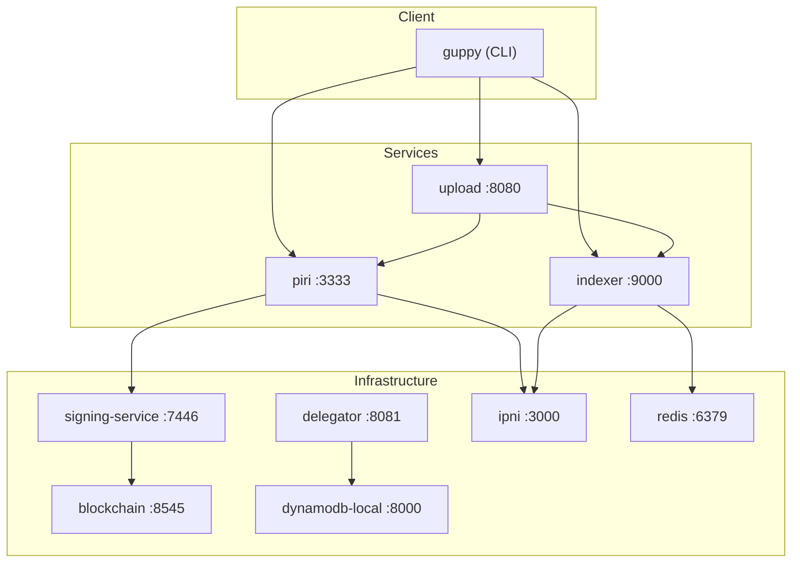

# Smelt

_The Smelter_ A complete Storacha network running on your laptop. Upload your first file in under five minutes.

Smelt is a Docker Compose environment that runs every service in the Storacha distributed storage network locally. It exists so you can test changes, debug integrations, and develop features without deploying anything to production—or waiting for anyone else.

## Quick Start

### Prerequisites

- Docker and Docker Compose
- Go 1.22+ (for key and proof generation)

### Start the Network

```bash
git clone https://github.com/storacha/smelt.git
cd smelt
make up
```

The first run takes a minute or two while Docker pulls images and generates cryptographic keys. Subsequent starts are faster.

### Verify Everything is Running

```bash
make status
```

Wait until all services show `healthy`. This typically takes 30-60 seconds after `make up` completes.

### Your First Upload

```bash
# Enter the guppy client container
make shell-guppy

# Create an account (inside the container)
guppy login your@email.com

# Create a storage space
guppy space create my-space

# Upload something
echo "Hello Storacha" > /tmp/hello.txt
guppy upload /tmp/hello.txt
```

You now have content stored on your local Storacha network, complete with blockchain proofs and content indexing.

## What's Running

| Service | Port | What It Does |
|---------|------|--------------|
| blockchain | 8545 | Local EVM (Anvil) with PDP smart contracts |
| dynamodb-local | 8000 | State persistence for services |
| redis | 6379 | Cache backend for indexer |
| signing-service | 7446 | Signs PDP blockchain operations |
| delegator | 8081 | UCAN delegation service |
| ipni | 3000, 3002, 3003 | Content discovery indexer |
| indexer | 9000 | Content claims cache |
| piri | 3333 | Storage node with PDP proofs |
| upload | 8080 | Upload orchestration service |
| guppy | — | CLI client for uploads (no exposed port) |

## Architecture



**Data flow**: Guppy sends upload requests to the upload service, which coordinates with piri (the storage node). Piri stores the content, submits PDP proofs to the blockchain via the signing service, and announces the content to IPNI for discovery. The indexer caches content claims for fast lookups.

## Common Commands

| Command | What It Does |
|---------|--------------|
| `make up` | Start the network (runs init automatically if needed) |
| `make down` | Stop the network (data preserved) |
| `make restart` | Stop and start all services |
| `make fresh` | Delete everything and start over |
| `make logs` | Follow logs from all services |
| `make status` | Show service health |
| `make shell-guppy` | Shell into the guppy container |

Run `make help` for the complete list.

## Where to Go Next

- **[Architecture Guide](docs/ARCHITECTURE.md)** — How the services connect and why
- **[Troubleshooting](docs/TROUBLESHOOTING.md)** — When things go wrong (they will)
- **[Extending Smelt](docs/EXTENDING.md)** — Adding services or modifying the environment

## A Note on Naming

Smelt: to extract metal from ore by heating. Also a small fish, but that's less relevant here. The name suggests refining raw materials into something useful—an apt metaphor for a development environment that lets you extract working features from experimental code without the overhead of production infrastructure.
