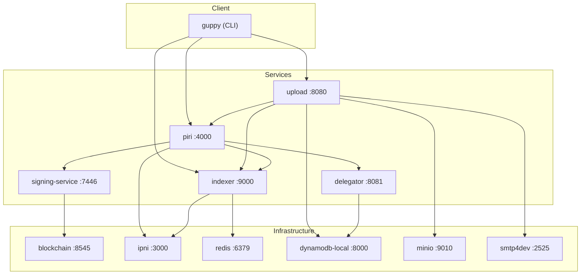

# Smelt ⚗️

_The Smelter_: A complete Storacha network running on your laptop. Upload your first file in under five minutes.

Smelt is a Docker Compose environment that runs every service in the Storacha distributed storage network locally. It exists so you can test changes, debug integrations, and develop features without deploying anything to production—or waiting for anyone else.

## Quick Start

### Prerequisites

- Docker engine 25+ (verified by the Makefile; older engines silently degrade on healthchecks and break snapshot portability)
- Docker Compose
- Go 1.22+ (required for `smelt generate`, the multi-piri manifest generator, and for UCAN delegation proof generation)
- Linux or macOS host

### Start the Network

```bash
git clone https://github.com/storacha/smelt.git
cd smelt
make up
```

The first run takes a minute or two while Docker pulls images and generates cryptographic keys. Subsequent starts are faster.

### Verify Everything is Running

```bash
make status
```

Wait until all services show `healthy`. This typically takes 30-60 seconds after `make up` completes.

### Your First Upload

```bash
# Enter the guppy client container
make shell-guppy

# Create an account (inside the container)
# Visit http://localhost:2580 and click the link (or programmatically get
# messages from http://localhost:2580/api/messages and POST to the link).
guppy login your@email.com

# Create a storage space (returns the space DID on stdout)
export SPACE=$(guppy space generate)

# Add a source then upload the space
echo "Hello Storacha" > /tmp/hello.txt
guppy upload source add "$SPACE" /tmp/hello.txt
guppy upload "$SPACE"
```

You now have content stored on your local Storacha network, complete with blockchain proofs and content indexing.

## What's Running

| Service         | Port             | What It Does                                                                  |
|-----------------|------------------|-------------------------------------------------------------------------------|
| blockchain      | 8545             | Local EVM (Anvil) with PDP smart contracts                                    |
| dynamodb-local  | 8000             | State persistence for services                                                |
| minio           | 9010             | S3-compatibe storage                                                          |
| redis           | 6379             | Cache backend for indexer                                                     |
| signing-service | 7446             | Signs PDP blockchain operations                                               |
| delegator       | 8081             | UCAN delegation service                                                       |
| ipni            | 3000, 3002, 3003 | Content discovery indexer                                                     |
| indexer         | 9000             | Content claims cache                                                          |
| piri-{N}        | 4000+N           | Storage node(s) with PDP proofs; N declared in `smelt.yml` (default 1, max 9) |
| upload          | 8080             | Upload orchestration service                                                  |
| guppy           | —                | CLI client for uploads (no exposed port)                                      |
| smtp4dev        | 2525             | SMTP server                                                                   |
| smtp4dev        | 2580             | Email UI and API                                                              |

## Architecture


```mermaid
flowchart TB
    subgraph Client
        guppy["guppy (CLI)"]
    end

    subgraph Services
        upload["upload :8080"]
        piri["piri :4000"]
        indexer["indexer :9000"]
        signing["signing-service :7446"]
        delegator["delegator :8081"]
    end

    subgraph Infrastructure
        blockchain["blockchain :8545"]
        ipni["ipni :3000"]
        redis["redis :6379"]
        dynamodb["dynamodb-local :8000"]
        minio["minio :9010"]
        email["smtp4dev :2525"]
    end

    guppy --> upload
    guppy --> piri
    guppy --> indexer

    upload --> piri
    upload --> indexer
    upload --> minio
    upload --> dynamodb
    upload --> email

    piri --> signing
    piri --> ipni
    piri --> delegator
    piri --> indexer
    signing --> blockchain

    delegator --> dynamodb
    indexer --> redis
    indexer --> ipni
```

**Data flow**: Guppy sends upload requests to the upload service, which coordinates with piri (the storage node). Piri stores the content, submits PDP proofs to the blockchain via the signing service, and announces the content to IPNI for discovery. The indexer caches content claims for fast lookups.

## Common Commands

| Command                       | What It Does                                                              |
|-------------------------------|---------------------------------------------------------------------------|
| `make up`                     | Start the network (runs init and regenerates compose if needed)           |
| `make up SNAPSHOT=<name>`     | Start the network from a saved snapshot (see below)                       |
| `make generate`               | Regenerate compose files and keys from `smelt.yml` (no container changes) |
| `make down`                   | Stop the network (data preserved)                                         |
| `make restart`                | Stop and start all services                                               |
| `make fresh`                  | Delete everything and start over                                          |
| `make logs`                   | Follow logs from all services                                             |
| `make status`                 | Show service health                                                       |
| `make shell-guppy`            | Shell into the guppy container                                            |
| `./smelt snapshot save NAME`  | Save the running stack's state as a named snapshot                        |
| `./smelt snapshot list`       | List saved snapshots                                                      |
| `./smelt snapshot rm NAME`    | Delete a snapshot                                                         |

Run `make help` for the complete list.

## Snapshots

Cold-boot takes ~45s (contract deploy + piri registration); restoring a
saved snapshot reaches the same state in ~10s. Capture a healthy stack
with `./smelt snapshot save NAME`, then later `make up SNAPSHOT=NAME`
to resume.

Snapshots are portable across Linux/macOS checkouts: commit them under
`snapshots/` at the project root to share with teammates, or keep
personal ones in the gitignored `generated/snapshots/`. Save captures
each service's image reference and content digest, so load warns both
when your `.env` points at a different tag and when a rolling tag was
re-pulled between save and load.

The full picture — what's captured, session semantics, workflows,
gotchas — lives in [docs/SNAPSHOTS.md](docs/SNAPSHOTS.md).

## Where to Go Next

- **[Getting Started](docs/GETTING_STARTED.md)** — First-time setup, key generation, and upload walkthrough
- **[Multi-Piri Configuration](docs/MULTI_PIRI.md)** — Running multiple piri nodes via `smelt.yml`
- **[Snapshots](docs/SNAPSHOTS.md)** — Capture and restore stack state to skip cold-boot time
- **[Architecture Guide](docs/ARCHITECTURE.md)** — How the services connect and why
- **[Troubleshooting](docs/TROUBLESHOOTING.md)** — When things go wrong (they will)
- **[Extending Smelt](docs/EXTENDING.md)** — Adding services or modifying the environment

## A Note on Naming

Smelt: to extract metal from ore by heating. Also a small fish, but that's less relevant here. The name suggests refining raw materials into something useful—an apt metaphor for a development environment that lets you extract working features from experimental code without the overhead of production infrastructure.
