# Smelt Architecture

## Start Here

Storacha is a decentralized storage network where data is stored across multiple providers with cryptographic verification. Unlike traditional cloud storage, content is addressed by its cryptographic hash (CID), and storage providers must prove they actually hold the data they claim to hold.

**Why so many services?** Each service has a specific responsibility. The storage node (Piri) stores blobs. The indexer tracks where content lives. The delegator manages authorization. The signing service handles blockchain transactions. This separation of concerns allows each component to be developed, tested, and scaled independently.

**The three main flows:**

1. **Upload**: Client shards data, coordinates with upload service, stores blobs on Piri, registers with indexer
2. **Retrieval**: Client queries indexer for content location, fetches blobs from storage provider
3. **Proof verification**: Storage providers periodically prove to blockchain contracts that they still hold stored data

**Mental model**: Think of it as a distributed file system where storage is verified cryptographically. Content addresses (CIDs) replace file paths. UCAN tokens replace access control lists. The blockchain replaces trust in a single provider.

---

## Glossary

| Term | Definition |
|------|------------|
| **CID** | Content Identifier. A cryptographic hash that uniquely identifies content by what it contains, not where it lives. |
| **DID** | Decentralized Identifier. A self-certifying identity (e.g., `did:key:z6Mk...`, `did:web:service`). |
| **UCAN** | User Controlled Authorization Networks. Capability-based authorization tokens that prove what you're allowed to do. |
| **Invocation** | A UCAN request to perform an action. |
| **Delegation** | Granting UCAN capabilities to another principal. |
| **Receipt** | Proof that a UCAN invocation was executed, containing the result. |
| **Capability** | A specific permission (e.g., `blob/allocate`, `space/blob/add`). |
| **PDP** | Provable Data Possession. Blockchain-verified storage proofs that ensure providers actually hold the data. |
| **IPNI** | InterPlanetary Network Indexer. Content discovery system that tracks which providers store which content. |
| **Content Claim** | A signed assertion about content (location, index, or equivalence). |
| **Location Claim** | Assertion that content can be retrieved from a specific URL. |
| **Index Claim** | Mapping from a content CID to an index CID describing how to locate blocks within shards. |
| **Blob** | Binary Large Object. A raw data chunk stored by a provider. |
| **Shard** | A blob that is part of a larger file. |
| **Space** | A user's storage namespace, identified by a DID. |
| **Multiaddr** | Multi-format address for network services (e.g., `/dns4/piri/tcp/3000/http`). |

---

## Table of Contents

1. [Start Here](#start-here)
2. [Glossary](#glossary)
3. [Service Dependency Graph](#service-dependency-graph)
4. [Services Overview](#services-overview)
5. [Content Claims System](#content-claims-system)
6. [UCAN Capability Flow](#ucan-capability-flow)
7. [Complete Upload Flow](#complete-upload-flow)
8. [Complete Retrieval Flow](#complete-retrieval-flow)
9. [Data Storage & Persistence](#data-storage--persistence)
10. [Authentication & Authorization](#authentication--authorization)

---

## Service Dependency Graph

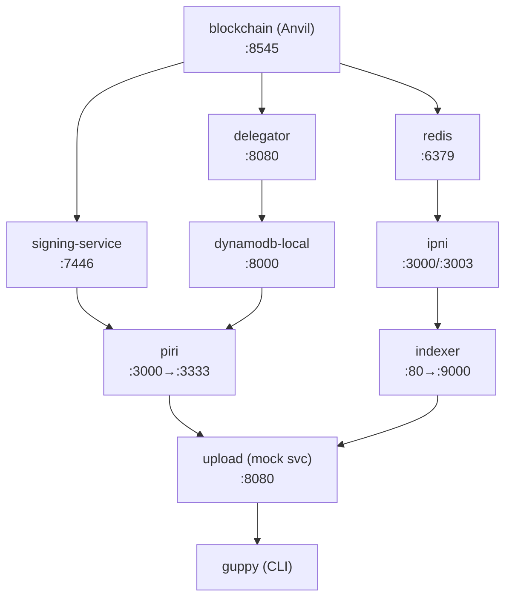

---

## Services Overview

### 1. Blockchain (Anvil) - Port 8545

**Role**: Local Filecoin-compatible EVM blockchain for PDP (Provable Data Possession) contracts.

**Image**: `ghcr.io/storacha/filecoin-localdev:b66c8bd`

**What it does**:
- Runs Anvil (Foundry's local Ethereum node) with 3-second block times
- Hosts PDP smart contracts that storage providers interact with
- Provides the foundation for proof-of-storage verification

**Interactions**:
- **signing-service** → blockchain: Signs PDP operations (createProofSet, addRoots, etc.)
- **delegator** → blockchain: May verify on-chain state
- **piri** → blockchain (via signing-service): Registers as a storage provider, submits proofs

---

### 2. Redis - Port 6379

**Role**: Cache backend for the indexing service.

**Image**: `redis:7-alpine`

**What it does**:
- Caches content claims and index lookups
- Provides fast retrieval for frequently accessed index data
- Stores temporary state for the indexer

**Interactions**:
- **indexer** → redis: Caches/retrieves content claims and location assertions

---

### 3. IPNI (storetheindex) - Ports 3000, 3002, 3003

**Role**: InterPlanetary Network Indexer - the canonical content discovery layer.

**Build context**: `../storetheindex`

**What it does**:
- **Port 3000 (Finder)**: Handles content queries - "Where can I find CID X?"
- **Port 3002 (Admin)**: Administrative operations
- **Port 3003 (Ingest)**: Receives advertisement chains from storage providers

**Interactions**:
- **indexer** → ipni:3000: Queries for content locations
- **piri** → ipni:3003 (indirect): Publishes advertisement chains announcing stored content

**How IPNI indexing works**:
1. Storage providers (like Piri) create "advertisement chains" - signed announcements of content they store
2. IPNI syncs these chains via the ingest endpoint
3. Clients query IPNI to discover which providers have specific content

---

### 4. Indexer Service - Port 80 (exposed as 9000)

**Role**: Storacha's caching layer for content claims - sits between clients and IPNI.

**Build context**: `../indexing-service`

**Identity**: `did:web:indexer` (mapped via PRINCIPAL_MAPPING to a did:key)

**Configuration**:
- `--public-url http://indexer:80`: Required so the indexer knows its own address for serving claims

**What it does**:
- Receives `assert/index` UCAN invocations to publish index claims
- Receives `claim/cache` UCAN invocations to cache location claims from proxies
- Caches claims in Redis for fast retrieval
- Forwards queries to IPNI when cache misses occur
- Provides the `/claims/{cid}` endpoint for fetching content claims

**UCAN Capabilities Handled**:

| Capability      | Description                                                    |
|-----------------|----------------------------------------------------------------|
| `assert/index`  | Publish an index claim linking content CID to index CID        |
| `assert/equals` | Publish an equals claim asserting two CIDs represent same data |
| `claim/cache`   | Cache a location claim from a proxy on behalf of a provider    |

**Key Endpoints**:

| Endpoint           | Description                                           |
|--------------------|-------------------------------------------------------|
| `/`                | Health check                                          |
| `/claims/{cid}`    | Fetch a specific claim by CID                         |
| `/claims?content=` | Query claims for content multihash                    |

**Interactions**:
- **upload** → indexer: Sends `assert/index` and `claim/cache` invocations
- **indexer** → redis: Caches index and location claims
- **indexer** → ipni: Queries for content provider locations
- **guppy** → indexer: Queries for content locations during retrieval

---

### 5. Upload Service (Mock) - Port 8080

**Role**: Simplified replacement for w3infra's upload-api. Orchestrates the upload workflow.

**Build context**: `./mock-upload-service`

**Identity**: `did:key:z6MkugC4LAhCir6Pv6S6p63G1c6Ju4sTwq5xt6Fxn1a1MkvE` (derived from PRIVATE_KEY)

**What it does**:
- Receives UCAN invocations from Guppy for all upload-related capabilities
- Coordinates with Piri for blob storage allocation
- Coordinates with Indexer for content indexing and location claim caching
- Stores receipts for async workflow coordination

**UCAN Capabilities Handled**:

| Capability         | Handler File          | Description                                       |
|--------------------|-----------------------|---------------------------------------------------|
| `access/authorize` | `access_authorize.go` | Email-based authorization flow                    |
| `access/claim`     | `access_claim.go`     | Retrieve delegations for a DID                    |
| `access/delegate`  | `access_delegate.go`  | Store delegations                                 |
| `space/blob/add`   | `space_blob_add.go`   | Main entry point - allocates blob via Piri        |
| `space/blob/replicate` | `space_blob_replicate.go` | **Stub** - replication not implemented      |
| `space/index/add`  | `space_index_add.go`  | Calls indexer's `assert/index`                    |
| `upload/add`       | `upload_add.go`       | Registers root CID with shards                    |
| `filecoin/offer`   | `filecoin_offer.go`   | **Stub** - Filecoin deals not implemented         |
| `ucan/conclude`    | `ucan_conclude.go`    | Completes async tasks, caches location claims     |
| `provider/add`     | `provider_add.go`     | Registers storage providers                       |

**Interactions**:
- **guppy** → upload: All upload UCAN invocations
- **upload** → piri: `blob/allocate` and `blob/accept` for storage
- **upload** → indexer: `assert/index` for indexing, `claim/cache` for location claims
- **upload** → dynamodb: Fetches Piri's delegation proof

**Key code paths**:
```
pkg/server/server.go:37    → Server initialization, creates all clients
pkg/service/service.go:69  → UCAN server with all handlers registered
pkg/piriclient/client.go   → UCAN client for Piri communication
pkg/indexerclient/client.go → UCAN client for Indexer communication (assert/index, claim/cache)
```

---

### 6. Piri - Port 3000 (exposed as 3333)

**Role**: Storage node implementing the Storacha storage protocol with PDP proofs.

**Build context**: `../piri`

**Identity**: `did:key:z6MkfYoQ6dppqssZ9qHF6PbBzCjoS1wWg15GYxNaMiLZn5RD`

**What it does**:
- Stores blob data on disk
- Generates PDP (Provable Data Possession) proofs
- Responds to blob allocation and accept requests
- Issues `assert/location` claims when blobs are accepted
- Publishes advertisement chains to IPNI

**UCAN Capabilities Handled**:

| Capability      | Description                                                  |
|-----------------|--------------------------------------------------------------|
| `blob/allocate` | Reserve space for a blob, return upload URL and address      |
| `blob/accept`   | Confirm blob has been uploaded, generate location commitment |

**UCAN Capabilities Required for Retrieval**:

| Capability               | Description                                       |
|--------------------------|---------------------------------------------------|
| `space/content/retrieve` | Required to serve blob data (authorized retrieval)|

**Two-phase initialization** (see `scripts/piri-entrypoint.sh`):
1. **Init phase**: Registers with blockchain via signing-service, gets delegation from delegator
2. **Serve phase**: Starts HTTP server with generated config

**Key Endpoints**:

| Endpoint         | Description                                |
|------------------|--------------------------------------------|
| `/piece/{cid}`   | Retrieve blob data (requires UCAN auth)    |
| `/claim/{cid}`   | Fetch claim delegation by CID              |

**Interactions**:
- **upload** → piri: `blob/allocate`, `blob/accept` invocations
- **piri** → signing-service: PDP operation signing (createProofSet, addRoots)
- **piri** → delegator: Gets delegation during init
- **piri** → dynamodb: Registers in allow-list during init
- **piri** → ipni: Publishes content advertisements (via HTTP announcements)
- **guppy** → piri: Retrieves blob data via `/piece/{cid}` with UCAN auth

**Key response from `blob/accept`**:
```go
type AcceptOk struct {
    Site ipld.Link  // Link to assert/location delegation (location claim)
}
```

The `Site` field contains a link to the location claim delegation that tells where the blob can be retrieved.

---

### 7. Guppy - CLI Client

**Role**: Command-line client for uploading and retrieving content from Storacha.

**Build context**: `../guppy`

**What it does**:
- Shards large files into smaller blobs
- Builds UnixFS DAG structures
- Sends UCAN invocations to upload service
- Polls for async receipts
- Retrieves content from storage providers via indexer queries

**Interactions**:
- **guppy** → upload: All UCAN invocations for upload workflow
- **guppy** → indexer: Queries for content locations during retrieval
- **guppy** → piri: Retrieves blob data with UCAN authorization
- Reads config from `/root/.config/guppy/config.toml`

**Key environment variables**:
- `STORACHA_SERVICE_DID`: Upload service's DID
- `STORACHA_SERVICE_URL`: Upload service endpoint
- `STORACHA_RECEIPTS_URL`: Receipt polling endpoint
- `STORACHA_INDEXING_SERVICE_DID`: Indexer's DID
- `STORACHA_INDEXING_SERVICE_URL`: Indexer endpoint
- `STORACHA_AUTHORIZED_RETRIEVALS`: Enable UCAN-authorized retrievals (required for piri)

---

### 8. DynamoDB Local - Port 8000

**Role**: Local DynamoDB for persisting delegations and allow-lists.

**Image**: `amazon/dynamodb-local:latest`

**Tables**:

| Table                     | Purpose                                      |
|---------------------------|----------------------------------------------|
| `delegator-allow-list`    | Storage providers allowed to get delegations |
| `delegator-provider-info` | Delegation proofs for registered providers   |
| `upload-allocations`      | Blob allocations pending acceptance          |
| `upload-receipts`         | Stored receipts for async task completion    |
| `upload-provisionings`    | Space provisioning records                   |

**Interactions**:
- **delegator** → dynamodb: Stores/retrieves allow-list and provider delegations
- **piri** → dynamodb: Registers in allow-list during init
- **upload** → dynamodb: Fetches Piri's delegation, stores allocations/receipts

---

### 9. Signing Service - Port 7446

**Role**: Signs PDP blockchain operations on behalf of storage providers.

**Build context**: `../piri-signing-service`

**What it does**:
- Holds the payer key for blockchain transactions
- Signs PDP operations: createProofSet, addRoots, submitProofs
- Provides HTTP endpoints for signing requests

**Interactions**:
- **piri** → signing-service: Requests signing of PDP operations
- **signing-service** → blockchain: Submits signed transactions

---

### 10. Delegator - Port 8080 (exposed as 8081)

**Role**: UCAN delegation service - issues delegations to registered storage providers.

**Build context**: `../delegator`

**Identity**: `did:web:delegator` (mapped to `did:key:z6MkqWbQaLBrYRKqyYwWakW97UcY4NFwgeiXxMuvv6Nf4gkr`)

**What it does**:
- Maintains allow-list of authorized storage providers
- Issues UCAN delegations for `blob/*` capabilities
- Enables upload service to invoke capabilities on Piri

**UCAN Capabilities Issued**:
- `blob/allocate` - delegated to upload service for invoking on Piri
- `blob/accept` - delegated to upload service for invoking on Piri

**Interactions**:
- **piri** → delegator: Requests delegation during init
- **delegator** → dynamodb: Stores delegations in provider-info table
- **upload** → dynamodb: Reads delegations for proof chains

---

## Content Claims System

The indexer maintains two types of claims that are essential for content retrieval:

### Location Claims (`assert/location`)

A **location claim** is a signed assertion that content matching a specific multihash can be retrieved from a particular URL. These claims are issued by storage providers (like Piri) when blobs are accepted.

**Structure (from w3-blob spec)**:
```jsonc
{
  "iss": "did:key:zStorageProvider",
  "aud": "did:key:zClient",
  "att": [{
    "can": "assert/location",
    "with": "did:key:zStorageProvider",
    "nb": {
      "space": { "/": { "bytes": "did:key:zSpace" } },
      "content": { "/": { "bytes": "mEi...sfKg" } },  // multihash
      "url": "https://storage-provider.example.com/blob/zQm...",
      "range": { "offset": 0, "length": 2097152 }
    }
  }],
  "exp": null
}
```

**Flow**:
1. Client uploads blob to Piri via HTTP PUT
2. Client calls `ucan/conclude` with http/put receipt
3. Upload service calls `blob/accept` on Piri
4. Piri returns location claim in `AcceptOk.Site`
5. Upload service extracts location claim and sends to indexer via `claim/cache`

### Index Claims (`assert/index`)

An **index claim** maps a content CID to an index CID that describes how to locate individual blocks within sharded blobs.

**Structure**:
```jsonc
{
  "iss": "did:key:zUploadService",
  "aud": "did:web:indexer",
  "att": [{
    "can": "assert/index",
    "with": "did:key:zUploadService",
    "nb": {
      "content": { "/": "bafy...content" },
      "index": { "/": "bafy...index" }
    }
  }]
}
```

**Flow**:
1. Client calls `space/index/add` with content CID and index CID
2. Upload service sends `assert/index` to indexer
3. Indexer publishes to IPNI and caches locally

### Claim Caching (`claim/cache`)

The `claim/cache` capability allows a proxy (like the upload service) to cache claims with the indexer on behalf of a storage provider.

**Why it's needed**: Storage providers like Piri publish claims independently, but the indexer also needs to know about these claims to answer retrieval queries. The `claim/cache` capability lets the upload service forward location claims to the indexer as part of the upload workflow.

**Structure**:
```jsonc
{
  "iss": "did:key:zUploadService",
  "aud": "did:web:indexer",
  "att": [{
    "can": "claim/cache",
    "with": "did:key:zUploadService",
    "nb": {
      "claim": { "/": "bafy...locationClaim" },
      "provider": {
        "addresses": [
          "/dns4/piri/tcp/3000/http/p2p/12D3KooW.../http-path/piece%2F{blobCID}",
          "/dns4/piri/tcp/3000/http/p2p/12D3KooW.../http-path/claim%2F{claim}"
        ]
      }
    }
  }],
  "prf": [{ "/": "bafy...locationClaim" }]  // The claim itself as proof
}
```

**Provider Addresses**: The multiaddr addresses include:
- `/p2p/{peerID}` component to identify the actual storage provider
- `{blobCID}` endpoint for blob retrieval
- `{claim}` endpoint for claim fetching

Both endpoints are required for the indexer to answer retrieval queries.

---

## UCAN Capability Flow

### Understanding UCAN

UCAN (User Controlled Authorization Networks) is a capability-based authorization system. Key concepts:

- **Invocation**: A signed request to perform an action
- **Capability**: Permission to do something (e.g., `space/blob/add`)
- **Delegation**: Granting capabilities to another principal
- **Receipt**: Proof that an invocation was executed, containing the result
- **Effect**: Side-effect tasks spawned by an invocation (fork/join semantics)

### Capability Hierarchy

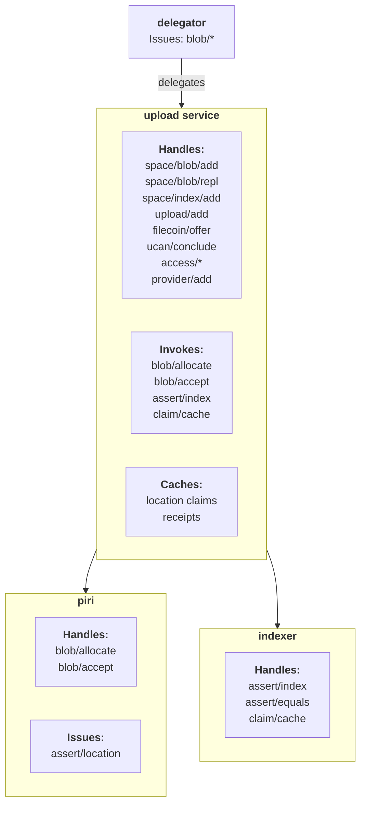

---

## Complete Upload Flow

This section traces a complete file upload from Guppy through all services.

### Phase 1: Initialization (One-time)

```
1. User creates a space:
   guppy space create "my-space"

   → Generates Ed25519 keypair for space (did:key:z6Mk...)
   → Stores locally in ~/.storacha/guppy/

2. User provisions space with upload service:
   guppy space provision did:key:z6Mk...

   → guppy sends access/authorize to upload service
   → upload service issues delegation for space/* capabilities
```

### Phase 2: Upload Flow

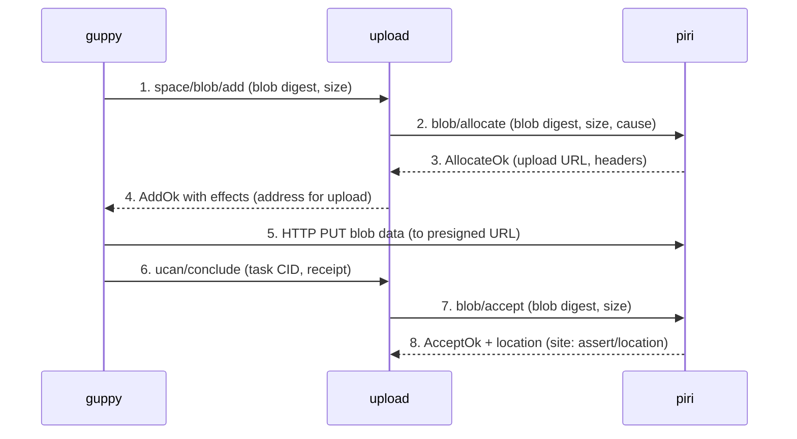

### Phase 3: Location Claim Caching

After receiving the `blob/accept` receipt from Piri, the upload service caches the location claim:

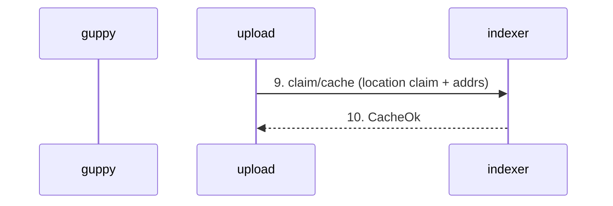

The `claim/cache` invocation includes:
- The location claim delegation from Piri
- Piri's provider addresses with `/p2p/{peerID}` component
- Both `{blobCID}` and `{claim}` endpoint templates

### Phase 4: Indexing Flow

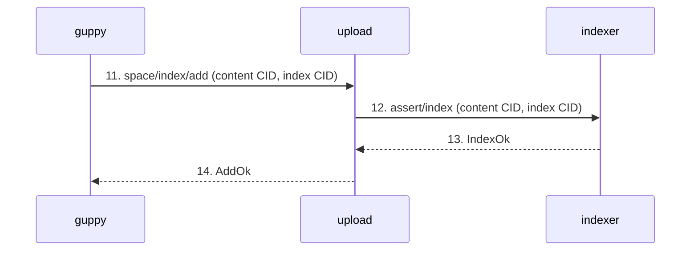

### Phase 5: Finalization

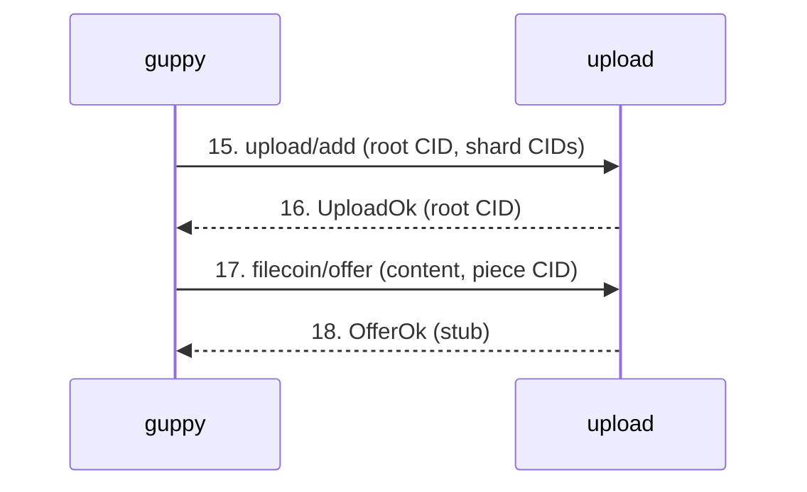

### Effect-Based Workflow Coordination

The `space/blob/add` handler returns **fork effects** that tell Guppy what to do next:

```go
// In space_blob_add.go
effects := fx.NewEffects().Fork(
    // Effect 1: HTTP PUT the blob
    httpPutInv,
    // Effect 2: Conclude with blob/accept
    concludeInv,
)
```

Guppy processes these effects:
1. Executes HTTP PUT to upload the blob data
2. Calls `ucan/conclude` to signal completion
3. Upload service then invokes `blob/accept` on Piri
4. Upload service caches location claim with indexer via `claim/cache`

---

## Complete Retrieval Flow

This section traces a complete content retrieval from Guppy through all services.

### Phase 1: Query Indexer

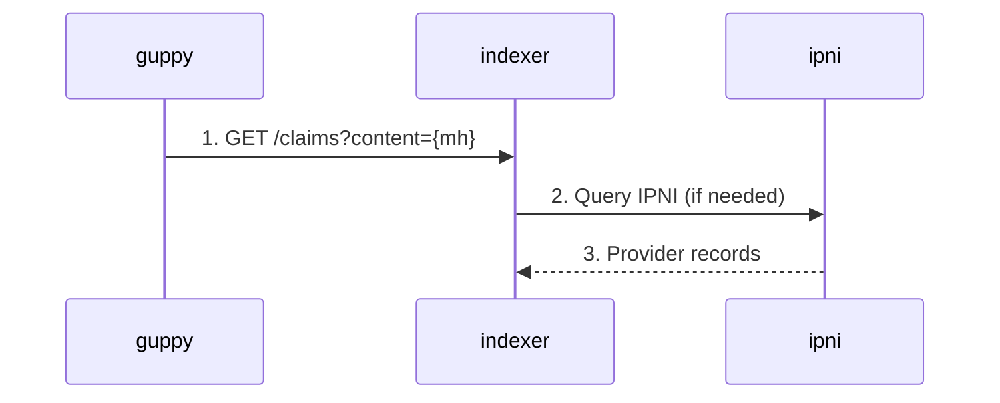

### Phase 2: Fetch Claims from Provider

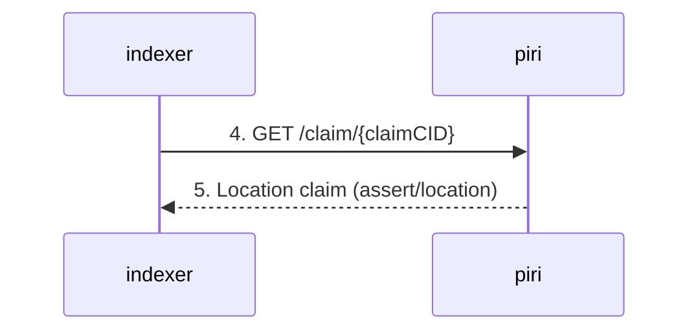

### Phase 3: Return Locations to Client

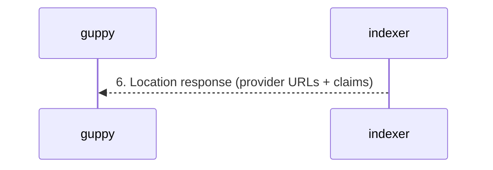

### Phase 4: Retrieve Content with UCAN Auth

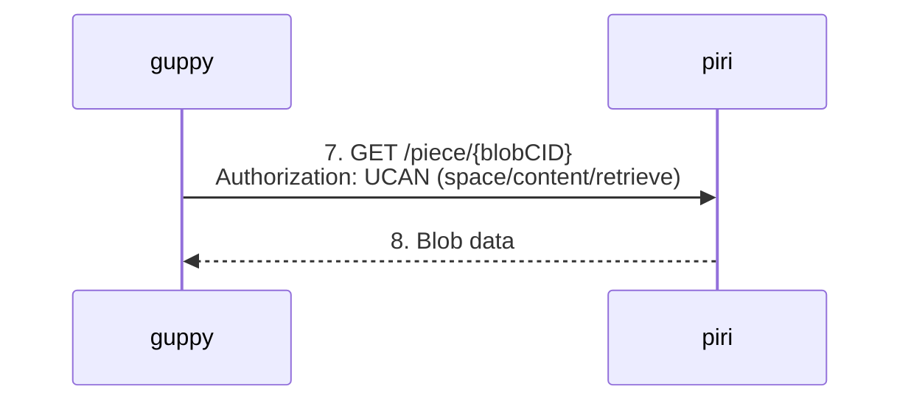

### Retrieval Authorization (`space/content/retrieve`)

Piri requires UCAN authorization for blob retrieval. The `space/content/retrieve` capability authorizes retrieving specific blob ranges:

```jsonc
{
  "iss": "did:key:zAgent",
  "aud": "did:key:zStorageProvider",
  "att": [{
    "can": "space/content/retrieve",
    "with": "did:key:zSpace",
    "nb": {
      "blob": {
        "digest": { "/": { "bytes": "mEi...sfKg" } }
      },
      "range": [0, 2097152]  // start and end byte (inclusive)
    }
  }],
  "exp": 123,
  "nnc": "unique-nonce"
}
```

**Key points**:
- Guppy must have `STORACHA_AUTHORIZED_RETRIEVALS=true` set
- The invocation is passed in the HTTP `Authorization` header
- Nonce or short expiry ensures invocations aren't replayed

---

## Data Storage & Persistence

### Volume Mappings

| Volume       | Container Path                 | Purpose                         |
|--------------|--------------------------------|---------------------------------|
| `ipni-data`  | `/home/nonroot/.storetheindex` | IPNI index data                 |
| `piri-data`  | `/data/piri`                   | Stored blobs and PDP proofs     |
| `guppy-data` | `/root/.storacha/guppy`        | Guppy's keystore and space info |
| `./keys`     | `/keys` (various)              | Shared cryptographic keys       |
| `./uploads`  | `/uploads`                     | Test files for upload           |

### Key Files

| File                           | Used By         | Purpose                        |
|--------------------------------|-----------------|--------------------------------|
| `keys/indexer.pem`             | indexer         | Service identity key           |
| `keys/delegator.pem`           | delegator       | Service identity key           |
| `keys/payer-key.hex`           | signing-service | Blockchain transaction signing |
| `config/guppy-config.toml`     | guppy           | Space configurations           |
| `config/delegator-config.yaml` | delegator       | Allow-list and DynamoDB config |
| `config/signer.yaml`           | signing-service | Contract addresses             |

---

## Authentication & Authorization

### DID Resolution

Local development uses `did:web` identifiers that are mapped to `did:key`:

```
did:web:delegator  →  did:key:z6MkqWbQaLBrYRKqyYwWakW97UcY4NFwgeiXxMuvv6Nf4gkr
did:web:indexer    →  (derived from indexer.pem)
did:web:piri       →  did:key:z6MkfYoQ6dppqssZ9qHF6PbBzCjoS1wWg15GYxNaMiLZn5RD
```

### Delegation Chain for Blob Operations

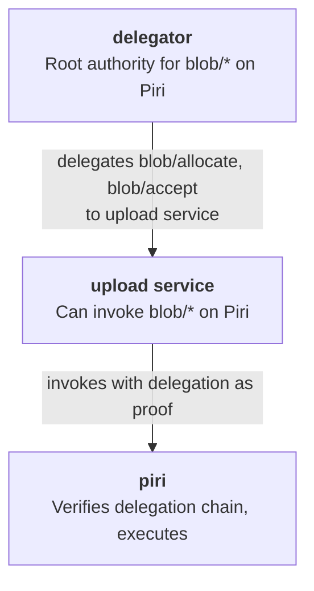

### Delegation Chain for Retrieval

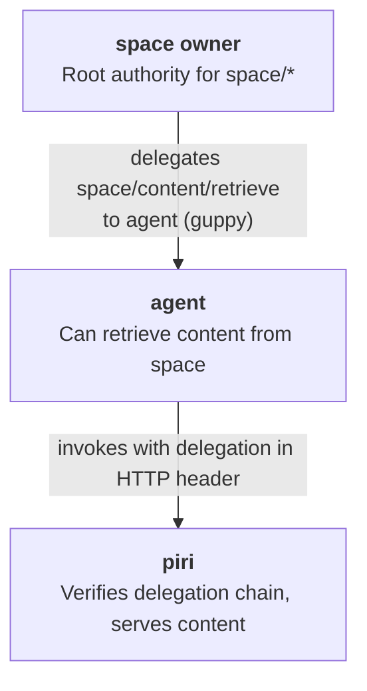

### Permissive Auth in Development

The mock upload service uses permissive authorization:

```go
// service.go:72
permissiveCanIssue := func(cap ucan.Capability[any], issuer did.DID) bool {
    return true // Allow all invocations in dev
}
```

This bypasses strict delegation chain verification for easier local development.

---

## Stub Handlers (Not Yet Implemented)

| Handler                | What It Should Do                      | Current Behavior      |
|------------------------|----------------------------------------|-----------------------|
| `space/blob/replicate` | Replicate blob to additional providers | Returns empty success |
| `filecoin/offer`       | Create Filecoin storage deals          | Echoes back piece CID |

---

## Quick Reference: Service Ports

| Service         | Internal Port | External Port | Protocol  |
|-----------------|---------------|---------------|-----------|
| blockchain      | 8545          | 8545          | JSON-RPC  |
| redis           | 6379          | 6379          | Redis     |
| ipni (finder)   | 3000          | 3000          | HTTP      |
| ipni (admin)    | 3002          | 3002          | HTTP      |
| ipni (ingest)   | 3003          | 3003          | HTTP      |
| indexer         | 80            | 9000          | HTTP/UCAN |
| upload          | 8080          | 8080          | HTTP/UCAN |
| piri            | 3000          | 3333          | HTTP/UCAN |
| dynamodb-local  | 8000          | 8000          | HTTP      |
| signing-service | 7446          | 7446          | HTTP      |
| delegator       | 8080          | 8081          | HTTP/UCAN |

---

## Testing an Upload and Retrieval

```bash
# 1. Enter guppy container
docker exec -it smelt-guppy-1 sh

# 2. Create and provision a space (first time only)
guppy space create test-space
guppy space provision <space-did>

# 3. Upload a file
guppy upload <space-did> /uploads/test10mb.bin

# Expected output:
# - Blob sharding
# - space/blob/add invocations
# - HTTP PUT operations
# - space/index/add
# - upload/add
# - filecoin/offer
# - Final root CID

# 4. Retrieve the file
guppy retrieve <space-did> <root-cid> ./downloads

# Expected output:
# - Query indexer for locations
# - Fetch blob from piri
# - Reconstruct file
```

---

## Troubleshooting

### "handler not found" errors
- Check that the handler is registered in `service.go:createUCANServer()`
- Verify the capability string matches exactly (e.g., `space/blob/add` not `blob/add`)

### Receipt not found
- Ensure `ucan/conclude` is storing receipts properly
- Check that receipt CID matches between invocation and retrieval

### Delegation errors
- Verify delegator is running and healthy
- Check that upload service can reach DynamoDB to fetch delegations
- Ensure PRINCIPAL_MAPPING is correct for did:web resolution

### Piri connection failures
- Check piri health: `curl http://localhost:3333/`
- Verify PIRI_DID matches piri's actual identity
- Check signing-service is healthy for PDP operations

### "no {claim} endpoint found in 0 addresses"
- Indexer needs `--public-url` configured to know its own address
- Upload service must send both `{blobCID}` and `{claim}` addresses in `claim/cache`
- Verify the multiaddr includes `/p2p/{peerID}` component

### "no locations found for block"
- Check that `claim/cache` was called after `blob/accept`
- Verify the location claim was extracted from piri's receipt
- Check indexer logs for `claim/cache` handling

### Retrieval authorization failures
- Ensure `STORACHA_AUTHORIZED_RETRIEVALS=true` in guppy config
- Check that guppy has a valid `space/content/retrieve` delegation
- Verify the blob digest and range match what's stored

---

## Specification References

For detailed protocol specifications, see:

- [W3 Blob Protocol](https://github.com/storacha/specs/blob/main/w3-blob.md) - Blob storage operations
- [W3 Index Protocol](https://github.com/storacha/specs/blob/main/w3-index.md) - Content indexing
- [W3 Retrieval Protocol](https://github.com/storacha/specs/blob/main/w3-retrieval.md) - Retrieval authorization
- [W3 Access Protocol](https://github.com/storacha/specs/blob/main/w3-access.md) - Delegation delivery
- [W3 Provider Protocol](https://github.com/storacha/specs/blob/main/w3-provider.md) - Provider registration
- [Content Server Authorization](https://github.com/storacha/specs/blob/main/content-serve-auth.md) - Gateway authorization
