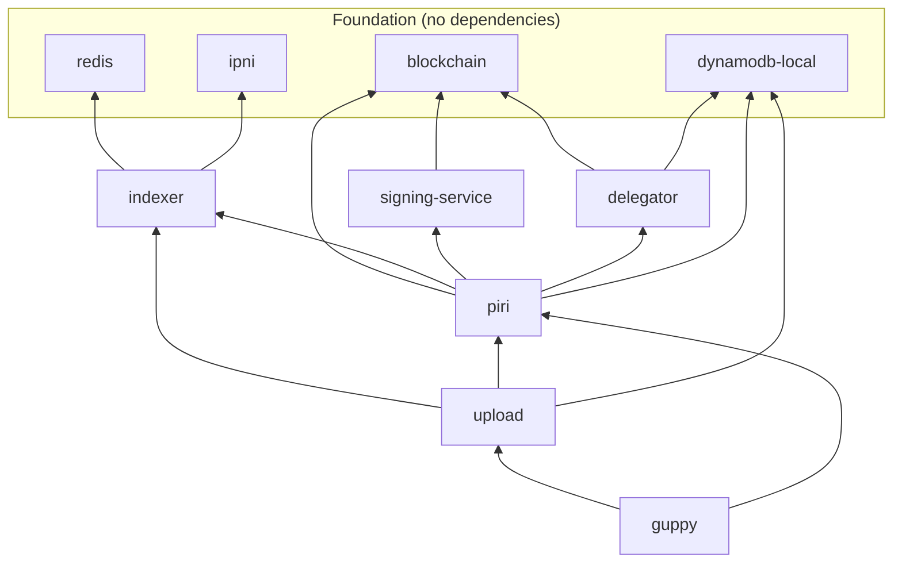

# Troubleshooting

When things go wrong. Find your symptom, follow the diagnostic steps, apply the solution.

---

## Table of Contents

1. [Service Health Issues](#service-health-issues)
2. [Upload Errors](#upload-errors)
3. [Retrieval Errors](#retrieval-errors)
4. [Blockchain Issues](#blockchain-issues)
5. [Container Issues](#container-issues)
6. [Network Issues](#network-issues)
7. [Key and Identity Issues](#key-and-identity-issues)
8. [Nuclear Options](#nuclear-options)
9. [Getting Help](#getting-help)
10. [Quick Diagnostic Commands](#quick-diagnostic-commands)

---

## Service Health Issues

### All Services Unhealthy

**Symptoms**: `make status` shows multiple services as unhealthy or not running.

**Common causes**:
- Docker daemon not running
- Docker network not created
- Keys not generated

**Diagnostic**:
```bash
# Check Docker is running
docker ps

# Check network exists
docker network ls | grep storacha

# Check keys exist
ls generated/keys/
```

**Solution**:
```bash
# If Docker isn't running, start it first
# Then:
make fresh
```

The `make fresh` command deletes everything and rebuilds from scratch. It handles network creation, key generation, and service startup in one operation.

---

### Specific Services Unhealthy

Services have dependencies. If a downstream service is unhealthy, check its dependencies first. This saves time.

#### IPNI Stays Unhealthy

**Expected behavior**: IPNI takes 30-60 seconds to initialize. This is normal.

**Diagnostic**:
```bash
docker compose logs ipni
```

**What to look for**:
- "No space left on device" — disk full, see [Container Issues](#no-space-left-on-device)
- Port binding errors — something else using ports 3000-3003
- Datastore initialization failures — corrupted state, run `make clean && make up`

**Solution**: Wait 60 seconds. If still unhealthy after that, check for the errors above.

---

#### Piri Stays Unhealthy

**Expected behavior**: Piri takes up to 3 minutes on first start. It performs a multi-step initialization:

1. Registers with the blockchain
2. Gets delegation from the delegator
3. Starts serving

The health check has a `start_period: 180s` to account for this.

**Diagnostic**:
```bash
docker compose logs piri
```

**What to look for**:
```
# Good — still initializing
Registering with blockchain...
Getting delegation from delegator...
Initializing storage...

# Bad — something failed
Failed to connect to signing-service
Registration with blockchain failed
Could not get delegation: connection refused
```

**Common issues and solutions**:

| Symptom | Cause | Solution |
|---------|-------|----------|
| "Failed to connect to signing-service" | signing-service not healthy | Check signing-service: `docker compose logs signing-service` |
| "Could not get delegation" | delegator not healthy | Check delegator: `docker compose logs delegator` |
| "Registration with blockchain failed" | blockchain not healthy | Check blockchain: `curl http://localhost:8545` |
| "Failed to extract DID" | Key file missing or malformed | Run `make nuke && make up` |

**Key insight**: Piri depends on five services. If piri is unhealthy, one of its dependencies likely is too. Check `make status` and fix unhealthy dependencies first.

---

#### Indexer Stays Unhealthy

**Dependencies**: Redis, IPNI

**Diagnostic**:
```bash
docker compose logs indexer
```

**What to look for**:
```
# Bad
Redis connection refused
Failed to connect to IPNI
```

**Common issues**:

| Symptom | Cause | Solution |
|---------|-------|----------|
| "Redis connection refused" | Redis not healthy | `docker compose logs redis` |
| "Failed to connect to IPNI" | IPNI not healthy | Wait for IPNI, then restart indexer |
| Healthy but queries fail | Stale cache | `make clean && make up` |

---

#### Upload Stays Unhealthy

**Dependencies**: indexer, piri, dynamodb-local

**Diagnostic**:
```bash
docker compose logs upload
```

**Common issues**:

| Symptom | Cause | Solution |
|---------|-------|----------|
| "Cannot connect to indexer" | Indexer not healthy | Fix indexer first |
| "Cannot connect to piri" | Piri not healthy | Fix piri first |
| "DynamoDB connection failed" | dynamodb-local not healthy | `docker compose logs dynamodb-local` |
| Starts but invocations fail | Delegation proof missing | `make nuke && make up` |

---

#### Signing Service or Delegator Stays Unhealthy

These services are simpler and rarely fail independently.

**Diagnostic**:
```bash
docker compose logs signing-service
docker compose logs delegator
```

**Common causes**:
- Blockchain not accessible (signing-service needs it)
- Key files missing or corrupted
- DynamoDB not accessible (delegator needs it)

**Solution**: If blockchain and dynamodb-local are healthy but these services aren't:
```bash
make nuke && make up
```

---

## Upload Errors

### "handler not found"

**Full error**: `Error: handler not found for capability: space/blob/add` (or similar)

**Cause**: The capability string must match exactly. Common mistakes:
- `blob/add` instead of `space/blob/add`
- `index/add` instead of `space/index/add`
- Typos in the capability name

**Diagnostic**: Check that the upload service is running the expected version:
```bash
docker compose logs upload | head -50
```

**Solution**:
```bash
# Rebuild the upload service
make down
docker compose build upload
make up
```

If using a custom upload service, check handler registration matches the capability string Guppy is sending.

---

### "delegation invalid" or UCAN Errors

**Full error**: `UCAN validation failed: delegation invalid` or `audience mismatch`

**Cause**: Keys were regenerated but services weren't restarted, or delegation proofs are stale.

**Solution**:
```bash
make clean && make up
```

This restarts services with fresh state but keeps the existing keys. If that doesn't work:
```bash
make nuke && make up
```

This regenerates all keys and proofs.

---

### "no space provider found" or Allocation Fails

**Full error**: `no space provider found` or `blob allocation failed`

**Cause**: Piri may not be registered in the delegator's allow-list.

**Diagnostic**:
```bash
# Check piri logs for registration
docker compose logs piri | grep -i "allow.list\|registering DID"

# Expected:
# Registering DID with allow list...
# Registration successful
```

**Solution**:
1. Restart piri: `docker compose restart piri`
2. Wait for initialization to complete (up to 3 minutes)
3. If still failing: `make nuke && make up`

---

### Upload Hangs Forever

**Cause**: Usually waiting for a service that's unhealthy.

**Diagnostic**:
```bash
make status
```

Check which services show unhealthy or starting. The upload flow requires:
- upload (orchestration)
- piri (storage)
- indexer (claim caching)
- dynamodb-local (state persistence)

**Common cause**: Piri initialization still in progress. Piri's first-time setup takes up to 3 minutes. Check:
```bash
docker compose logs -f piri
```

Wait for `Server listening on :3000` before retrying uploads.

---

### "receipt not found"

**Full error**: `receipt not found` or `no receipt for invocation`

**Cause**: The async workflow was interrupted. Receipts are stored in DynamoDB; if DynamoDB was reset mid-upload, the receipt is gone.

**Solution**:
1. Retry the upload
2. If persistent: `make clean && make up`

---

## Retrieval Errors

### "no locations found"

**Full error**: `no locations found for block` or `no locations found for content`

**Cause**: The content may not have been indexed yet, or indexing failed.

**Diagnostic**:
```bash
# Check indexer logs for the content CID
docker compose logs indexer | grep -i "claim/cache\|assert/index"

# Look for:
# Received claim/cache for <multihash>
# Published assert/index for <content CID>
```

**Solution**:
1. Wait a few seconds and retry — indexing is asynchronous
2. Re-upload the content if indexing failed
3. Check that the indexer is healthy: `curl http://localhost:9000/`

---

### "unauthorized" or Retrieval Auth Failures

**Full error**: `unauthorized` or `UCAN validation failed`

**Cause**: Guppy needs `authorized_retrievals = true` in its configuration to send UCAN-authorized requests to piri.

**Diagnostic**:
```bash
# Check guppy config
docker compose exec guppy cat /root/.config/guppy/config.toml | grep authorized
```

**Solution**:
1. Verify `authorized_retrievals = true` in guppy config
2. Ensure guppy has a valid `space/content/retrieve` delegation for the space
3. Restart guppy: `docker compose restart guppy`

---

### Content CID Works but File is Corrupted

**Cause**: Shards may be partially uploaded or indexed.

**Diagnostic**:
```bash
# Re-upload and watch for errors
guppy upload <file>
```

**Solution**: Re-upload the file. If the problem persists, check piri's storage volume:
```bash
docker compose exec piri ls -la /data/piri/
```

If storage is corrupted: `make clean && make up` to reset volumes.

---

## Blockchain Issues

### "nonce too low" or Transaction Errors

**Full error**: `nonce too low` or `transaction underpriced`

**Cause**: Blockchain state is inconsistent. This happens when the blockchain was reset but other services weren't, or vice versa.

**Solution**:
```bash
make fresh
```

This resets everything — blockchain, keys, and service state — ensuring consistency.

---

### Contract Calls Fail

**Diagnostic**:
```bash
# Check blockchain is responding
curl -X POST http://localhost:8545 \
  -H "Content-Type: application/json" \
  -d '{"jsonrpc":"2.0","method":"eth_blockNumber","params":[],"id":1}'

# Expected: {"jsonrpc":"2.0","id":1,"result":"0x1234"}
# (some hex block number)
```

If no response or error:
```bash
docker compose logs blockchain
```

**Common issues**:

| Symptom | Cause | Solution |
|---------|-------|----------|
| No response | Blockchain container crashed | `docker compose restart blockchain` |
| "contract not deployed" | Blockchain state corrupted | `make fresh` |
| Persistent failures | State directory corrupted | `make nuke && make up` |

---

### PDP Proof Submission Fails

**Symptoms**: Piri logs show "PDP proof submission failed" or similar.

**Diagnostic**:
```bash
docker compose logs signing-service
docker compose logs piri | grep -i "PDP\|proof"
```

**Common causes**:
- Signing service not healthy
- Blockchain not accepting transactions
- Payer key has no funds (shouldn't happen in local dev)

**Solution**:
1. Check signing-service is healthy
2. Check blockchain is healthy
3. If both are healthy: `make fresh`

---

## Container Issues

### "no space left on device"

**Cause**: Docker images and volumes consume disk space.

**Diagnostic**:
```bash
# Check Docker disk usage
docker system df

# Check host disk usage
df -h
```

**Solutions**, in order of severity:

```bash
# Level 1: Remove Smelt's volumes only
make clean

# Level 2: Remove Smelt's volumes AND images
make nuke

# Level 3: Remove ALL unused Docker resources
docker system prune -a

# Level 4: Remove ALL Docker resources including volumes (affects other projects)
docker system prune -a --volumes
```

Level 3 and 4 affect other Docker projects on your machine. Use with caution.

---

### Port Already in Use

**Full error**: `Error starting userland proxy: listen tcp4 0.0.0.0:8545: bind: address already in use`

**Diagnostic**:
```bash
# Find what's using the port (replace 8545 with the conflicting port)
lsof -i :8545

# Alternative on Linux
ss -tlnp | grep 8545
```

**Solution**: Stop the conflicting process, or modify the port mapping in the relevant `compose.yml` file.

Common port conflicts:

| Port | Service | Common conflicts |
|------|---------|------------------|
| 8545 | blockchain | Other Ethereum nodes, Foundry, Hardhat |
| 3000 | ipni | Development servers (React, Next.js, etc.) |
| 6379 | redis | Other Redis instances |
| 8000 | dynamodb-local | Other dev servers |

---

### Permission Denied on generated/

**Full error**: `permission denied: generated/keys/piri.pem`

**Cause**: Directory was created with different user permissions (common when mixing `sudo` with regular Docker commands).

**Solution**:
```bash
sudo chown -R $USER:$USER generated/
```

---

### Container Exits Immediately

**Diagnostic**:
```bash
# Check exit code and logs
docker compose ps -a
docker compose logs <service-name>
```

**Common causes**:
- Missing configuration file
- Missing key file
- Invalid configuration syntax

**Solution**: Check logs for the specific error. Usually indicates a missing file that `make init` should have created. Run:
```bash
make nuke && make up
```

---

## Network Issues

### Services Can't Communicate

**Symptoms**: Services log "connection refused" or "could not resolve hostname" when trying to reach other services.

**Diagnostic**:
```bash
# Check Docker network exists
docker network ls | grep storacha

# Should show:
# storacha-network   bridge   local

# Check services are on the network
docker network inspect storacha-network
```

**Solution**:
```bash
# If network doesn't exist
make init

# If network exists but services can't communicate
make fresh
```

---

### "connection refused" Between Services

**Cause**: Target service may not be healthy yet, or may be listening on a different port.

**Diagnostic**:
```bash
# Test connectivity from one service to another
docker compose exec upload curl http://piri:3000/
docker compose exec indexer curl http://ipni:3000/health
```

**Common issues**:

| Error | Cause | Solution |
|-------|-------|----------|
| "Connection refused" | Service not ready | Wait and retry, or check target service health |
| "Could not resolve host" | Network issue | `make fresh` |
| "Connection timed out" | Firewall or network config | Check Docker network settings |

---

### Host Can't Reach Services

**Symptoms**: `curl http://localhost:8080/` fails from your host machine.

**Diagnostic**:
```bash
# Check port mappings
docker compose ps

# Verify the port is published (shows "0.0.0.0:8080->80/tcp")
```

**Common causes**:
- Service uses a different internal port than expected
- Service is binding to a specific interface instead of all interfaces
- Firewall blocking the port

**Solution**: Check the `ports` section in the service's compose.yml. The format is `host:container`.

---

## Key and Identity Issues

### "unknown DID" or Identity Errors

**Full error**: `unknown DID` or `DID not found` or `principal not recognized`

**Cause**: Keys are mismatched between services, or a service is using a DID that others don't recognize.

**Solution**:
```bash
make nuke && make fresh
```

This regenerates all keys and ensures consistency across services.

---

### mkdelegation Not Found

**Full error**: `mkdelegation: command not found` or `go-mkdelegation not installed`

**Cause**: Go is not installed, not in PATH, or the tool wasn't installed.

**Diagnostic**:
```bash
which go
which mkdelegation
```

**Solutions**:

```bash
# Option 1: Install Go and re-run init
# (Go 1.22+ required)
brew install go  # macOS
# or
sudo apt install golang-go  # Debian/Ubuntu

make init

# Option 2: Install mkdelegation directly
go install github.com/storacha/go-mkdelegation@latest

# Option 3: Ensure GOBIN is in PATH
export PATH="$PATH:$(go env GOPATH)/bin"
```

After installing, run `make init` again to generate the delegation proofs.

---

### PRINCIPAL_MAPPING Errors

**Full error**: `principal mapping invalid` or `could not resolve did:web`

**Cause**: The PRINCIPAL_MAPPING environment variable that maps `did:web` to `did:key` is misconfigured.

**Diagnostic**:
```bash
# Check the mapping in a service's environment
docker compose exec indexer env | grep PRINCIPAL
```

**Solution**: This is usually a configuration error in the compose files. If you haven't modified them:
```bash
make nuke && make up
```

If you've modified the compose files, verify the PRINCIPAL_MAPPING format:
```
PRINCIPAL_MAPPING=did:web:service->did:key:z6Mk...
```

---

## Nuclear Options

When targeted fixes don't work, escalate through these options. Each level is more destructive.

```bash
# Level 1: Restart with fresh state but keep keys
# Keeps your service identities, clears all stored data
make clean && make up

# Level 2: Regenerate keys and restart
# New identities for all services, clears all data
make nuke && make up

# Level 3: Complete scorched earth
# Nukes everything, rebuilds images, starts fresh
make fresh

# Level 4: Docker scorched earth
# Use when Docker itself seems broken
# WARNING: Affects ALL Docker projects on your machine
docker system prune -a --volumes
make fresh
```

**When to use each level**:

| Level | Use when |
|-------|----------|
| 1 | Services working but data is corrupted |
| 2 | UCAN/delegation errors that won't clear |
| 3 | Services won't build or start at all |
| 4 | Docker networking broken, images corrupted |

---

## Getting Help

### Before Asking for Help

1. **Check the logs**: `make logs` or `docker compose logs <service>`
2. **Verify dependencies are healthy**: Fix unhealthy dependencies before debugging the failing service
3. **Try a fresh start**: `make fresh` resolves most issues
4. **Read the Architecture guide**: [docs/ARCHITECTURE.md](ARCHITECTURE.md) explains how services interact

### Where to Get Help

- **File an issue**: [github.com/storacha/smelt/issues](https://github.com/storacha/smelt/issues)
- **Include in your issue**:
  - Output of `make status`
  - Relevant service logs (`docker compose logs <service>`)
  - What you were trying to do
  - What happened instead

---

## Quick Diagnostic Commands

Copy-paste these commands for rapid diagnosis.

### Overall Health

```bash
# Service status
make status

# All logs
make logs

# Specific service logs
docker compose logs -f piri
docker compose logs -f upload
docker compose logs -f indexer
```

### Service Health Checks

```bash
# Blockchain (should return block number)
curl -s -X POST http://localhost:8545 \
  -H "Content-Type: application/json" \
  -d '{"jsonrpc":"2.0","method":"eth_blockNumber","params":[],"id":1}' | jq

# IPNI (should return "ready")
curl -s http://localhost:3000/health

# Indexer (should return 200 OK)
curl -s -o /dev/null -w "%{http_code}" http://localhost:9000/

# Piri (should return 200 OK)
curl -s -o /dev/null -w "%{http_code}" http://localhost:3333/

# Upload (should return 200 OK)
curl -s -o /dev/null -w "%{http_code}" http://localhost:8080/health

# Delegator (should return health status)
curl -s http://localhost:8081/healthcheck

# Signing Service (should return health status)
curl -s http://localhost:7446/healthcheck
```

### Network and Infrastructure

```bash
# Check Docker network
docker network inspect storacha-network

# Check disk space
docker system df
df -h

# Check all containers (including stopped)
docker compose ps -a

# Check keys exist
ls -la generated/keys/

# Check proofs exist
ls -la generated/proofs/
```

### Inter-Service Connectivity

```bash
# Test upload -> piri connectivity
docker compose exec upload wget -q -O- http://piri:3000/ && echo "OK" || echo "FAILED"

# Test upload -> indexer connectivity
docker compose exec upload wget -q -O- http://indexer:80/ && echo "OK" || echo "FAILED"

# Test piri -> blockchain connectivity
docker compose exec piri wget -q -O- --post-data='{"jsonrpc":"2.0","method":"eth_blockNumber","params":[],"id":1}' \
  --header='Content-Type: application/json' http://blockchain:8545 && echo "OK" || echo "FAILED"
```

### Service-Specific Diagnostics

```bash
# Piri initialization status
docker compose logs piri | grep -E "init|register|delegation|serving" | tail -20

# Upload handler registration
docker compose logs upload | grep -E "handler|capability" | head -20

# Indexer claim processing
docker compose logs indexer | grep -E "claim|cache|index" | tail -20

# Delegator allow-list
docker compose logs delegator | grep -E "allow|register|delegation" | tail -20
```

---

## Quick Reference: Service Dependencies

When a service is unhealthy, check its dependencies first.



If `upload` is unhealthy, check `indexer`, `piri`, and `dynamodb-local` first.

If `piri` is unhealthy, check `blockchain`, `signing-service`, `delegator`, `indexer`, and `dynamodb-local` first.

Work from the bottom up.
